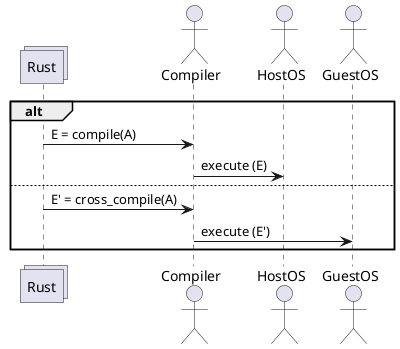

# Cross Compilation

```
Amanieu d'Antras
Principal Rust Expert
Trustworthy Open-Source Software Engineering Lab &
Ireland Research Centre
Huawei Technology, Inc.
```
## Detailed descriptions see 

Rust’s tier system is being formalized with guarantees and expectations set in an in-progress RFC.  See https://github.com/rust-lang/rfcs/pull/2803. 


## Updates

- [x] Cortex M3/M7 chipsets uses `no_std`: `cty` crate provides type for `no_std`, which is stable. 
- [x] `cstr_core` also provides features not avaialble in `std` library. 
- [x] Compiler targets `thumbv6`, `thumbv7m`, `thumbv7em` already  support Cotex M3/M7 respectively. 
- [ ] To clarify whether there is a need to fix an issue for `no_std` in `cty` crate 
- [ ] Waiting for the code and development environment from hardware product lines

