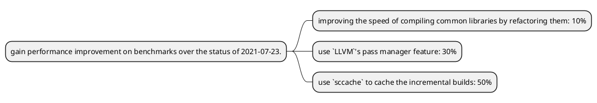

# Speed up compilation time

```
Amanieu d'Antras, Yijun Yu
Trustworthy Open-Source Software Engineering Lab &
Ireland Research Centre
Huawei Technology, Inc.
```

**Aim**: gain performance improvement on benchmarks over the status of 2021-07-23. 

https://perf.rust-lang.org/compare.html?start=2021-07-23



## Method 1: improve the speed of compiling common (standard) libraries, such as the `syn` crate, by refactoring

## Method 2: use downstream compiler LLVM's new feature such as pass manager (since LLVM 13.0)

According to this following [twitter message](https://twitter.com/ryan_levick/status/1443202538099073027), generally a speed gain of 10-30% can be registered.


## Method 3: use the `sccache` to reduce build time when previous compilation is cached

For the fresh build, however, this method has a limitation to requiring more prefetched cache storage. 

## Updates

- [x] Method 1: an estimate of 10% performance gain can be obtained for the benchmarks.
- [x] Method 2: according to one product line, this feature alone could reduce compilation time by 30%. 
- [x] Method 3: According to the experiment on the Rust compiler itself, within the build of OpenEuler, we are able to reduce the compilation time by 50% using this technique alone. 
