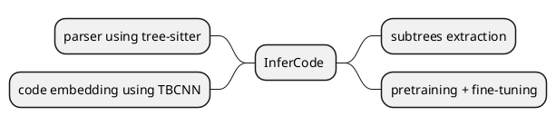
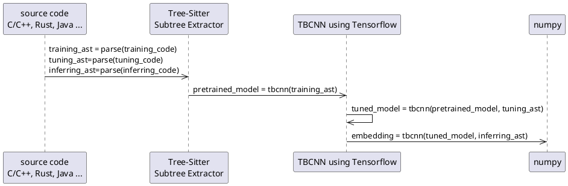

InferCode works based on the key idea of using an encoder to predict subtrees as a pretext task. Then the weights learned from the encoder can be used to transfer for other downstream tasks. This is to alleviate the need for the huge amount of labeled data to build decent code learning models in Software Engineering. With this concept, representation learning models for  source code can now learn from unlabeled data.

We trained our model on a dataset comprised of 19 languages, which are: java, c, c++, c#, golang, javascript, lua, php, python, ruby, rust, scala, kotlin, solidity, haskell, r, html, css, bash. We use [tree-sitter](https://github.com/tree-sitter/tree-sitter) as the backbone to parse these languages to AST. This is a bit different from the implementation we reported in our paper, which used [srcml](https://www.srcml.org/) as the AST parser. The reasons are that we found that tree-sitter supports more language than srcml, and tree-sitter also provides a [python binding interface](https://github.com/tree-sitter/py-tree-sitter), which makes it easy to parse any code snippet into AST by using python code. A details of our old implementation using srcml can be found in [old_version](old_version/).