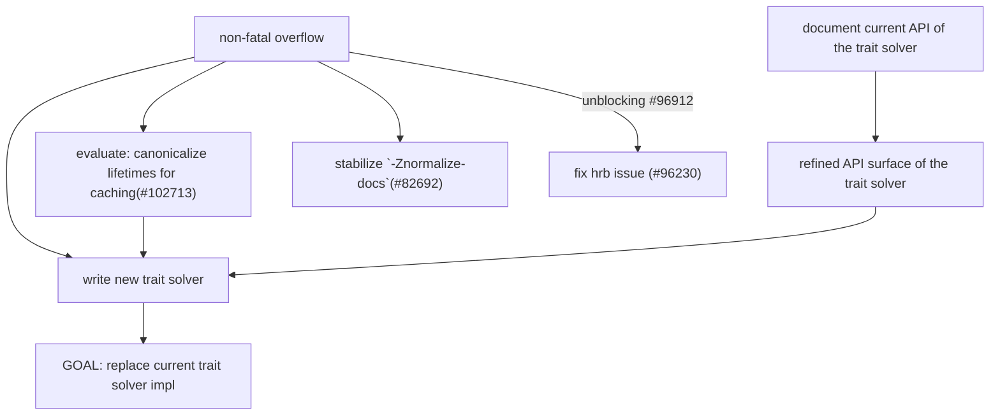

# Trait System Rewrite 

```
Bastian Kauschke (lcnr)
Trusted Programming
Huawei Technologies, Inc. & LCNR
```

Tracked by https://github.com/rust-lang/types-team/issues/58

## Proposal
Start an initiative with the goal of replacing the current trait system implementation of rustc. This new implementation should fully replace both fulfill and evaluate and offer an API a lot closer to the ideal of `chalk`/`a-mir-formality`.

## Goals of this initiative
- greatly simplify future changes to the trait system, unblocking features like marker traits and fixes for existing soundness bugs
- better learnability, the current system is difficult to learn and understand
- far better[^1] caching with an estimated impact of
- reducing compilation-time of some real world crates to less than half for less type-heavy crates 0% and 15% improvements
- in rare cases, may initially slightly worsen performance
- reduces the chance of trait system bugs in the future

## Explicit non-goals of this initiative
This initiative does not intend to implement any major changes to the trait system as part of the replacement. The new replacement should closely mirror the old system at the time of replacement to minimize the risk of backwards compatibility issues.

We also do not intend to extract any shared code with rust-analyzer as part of this initiative. While that will be easier after this work has been completed, the sole focus of this initiative is to replace the existing solvers with a solver which results in the advantages noted above.

## Outline of the planned work
Start by clearly laying out how the compiler uses the existing trait solvers and what API has to be provided by the new solver.

Any parts strongly tied to the architecture of the current solvers have to be rewritten where possible. The biggest challenge will be trait diagnostics, which should be rewritten to be as solver agnostic as possible. Instead of relying on solver internals, diagnostics should lazily recompute necessary information where possible. This may require a reimplementation of our trait diagnostics to replace the existing one.

Once this is done, work on a new solver directly in rustc to replace both evaluate and fulfill. When that solver is ready, replace all uses of evaluate and fulfill with the new solver and remove evaluate and fulfill. At that point this initiative can be closed again.

For more information, see this document

## Initial members
@lcnr as lead, other Types Team members depending on interest.

[^1]: currently different FnCtxt and ObligationCtxt do not share a cache for fulfill and also don't share it with mir borrowck. 

##  Comments
This issue is not meant to be used for technical discussion. There is a Zulip stream for that. Use this issue to leave procedural comments, such as volunteering to review or raising a concern that you would like to be addressed.

## Rationale

1. A type system unsoundness which is still not fixed would be https://github.com/rust-lang/rust/issues/100051 while a similar issue I've recently fixed is https://github.com/rust-lang/rust/issues/98543.
Note the required explicit (and without this bug useless) 'for<'what, 'ever> &'what &'ever (): Trait,' clause on the impl in the example. Without it, this unsoundness cannot be triggered.

2. An example of a dependency between Const Generics and my type system work is that default for arrays of all sizes requires us to first stabilize the marker traits feature (https://github.com/rust-lang/rust/issues/29864).
This feature requires my type system work to be stabilized.

3. After a private conversation with the other Type Team members I've now officially published a proposal for a new "trait system rewrite initiative" with myself as the lead: 

## Roadmap



There are still many unknown unknowns here, especially  "refined API surface of the trait solver" requires research to figure out the necessary steps. It is known that diagnostics heavily rely on trait system internals, but the amount of effort required to refactor that is still not clear. The desired API surface of the trait solver will also continue to evolve as we are implementing the new solver.

"non-fatal overflow" and "canonicalize lifetimes for caching" are a lot more self-contained and are important milestones. Especially "non-fatal overflow" has a noticeable direct impact.

The rewrite initiative will only work on steps directly required for "GOAL: replace current trait solver impl". Once this is done, the initiative will be closed again and the blockers for keyword generics and const generics can be tackled next. At this point we should get the compile-time improvements described in https://github.com/rust-lang/types-team/issues/58.

## Updates

- [ ] evaluate: canonicalize lifetimes for caching(#102713)
- [ ] stabilize `-Znormalize-docs`(#82692)
- [ ] write new trait solver
- [ ] unblocking #96912
- [ ] fix hrb issue (#96230)

