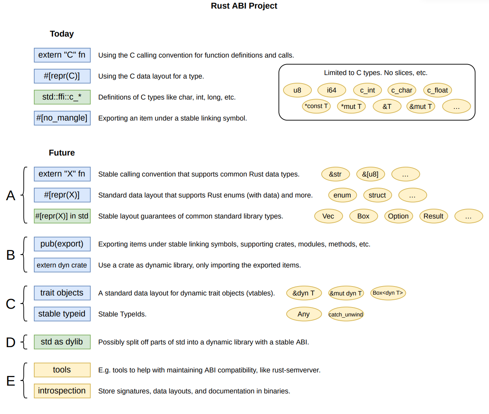

# Rust ABI

```
Mara Bos, Amanieu d'Antras
Trustworthy Open-Source Software Engineering Lab &
Ireland Research Centre
Huawei Technology, Inc.
```

## Roadmap 
The goal of Rust ABI can be found in this diagram:
 
. 

A quick sketch of what the future of Rust ABI might look like. (A big part of the project will be to find out the details of all these ideas, so this is just a rough sketch, not an accurate plan.)

There's a box for each related feature. Blue for language+compiler, green for library, yellow for tools/misc.

The future features are grouped into:

A. Data layout and calling convention (stable layout for slices, standard convention for enums with data, returning Result, etc.).
B. Exporting/importing dynamic libraries (including name mangling, versioning, etc.).
C. Advanced data types (trait objects).
D. Standard library as dynamic library with a stable ABI.
E. Ergonomics.

They don't have to be done in this order, but we'll probably start with A. I don't expect many surprises in the work for A, but the work for B and C will require more research, experimentation and design work, and might take a different shape. D might be controversial, depending on the details. E is less critical, and will probably be left for later.

## Updates

- [ ] Get approval of the RFI proposal

